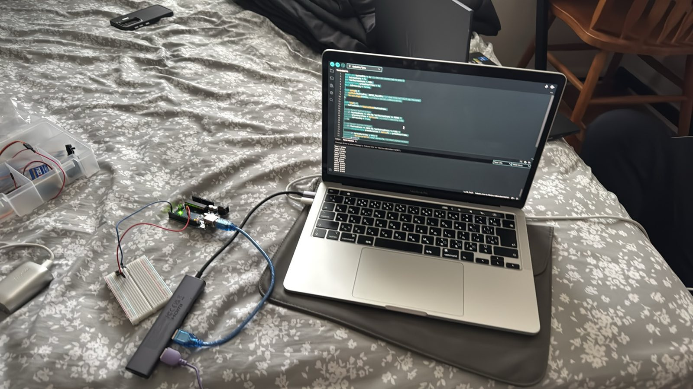

# Arduino Dino Game Controller

A physical controller my group built for the Google Chrome Dinosaur Game using an Arduino.

This was a STEM project at Lutheran High School of Indianapolis in April 2025. I did most of the hands-on work with the Arduino, including wiring the breadboard, working with the code, testing different setups, and troubleshooting when things didn't work.

## How it worked

We started by using an LED to check whether the circuit was detecting an input correctly. We then connected the controller to the game so a physical input could make the dinosaur jump.

We experimented with different input methods, including a button and a rotating component. In the final setup, twisting the metal component past a certain angle was detected by the Arduino and triggered the dinosaur to jump.

## What I used

- Arduino
- Arduino IDE
- Breadboard
- Jumper wires
- LEDs
- Physical input components

## Project photo

## Demo

[Watch the controller in action](controller-demo.mov)

The controller detects the rotation of the physical input and triggers the dinosaur to jump once the input reaches the required position.
